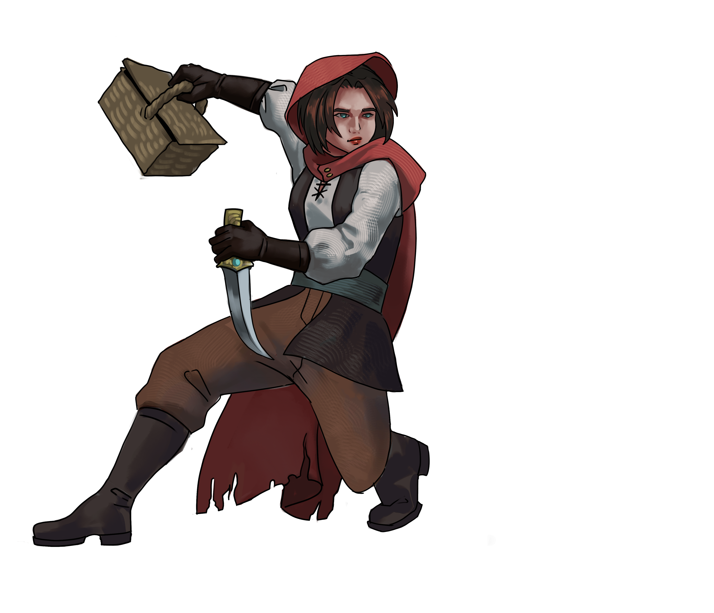
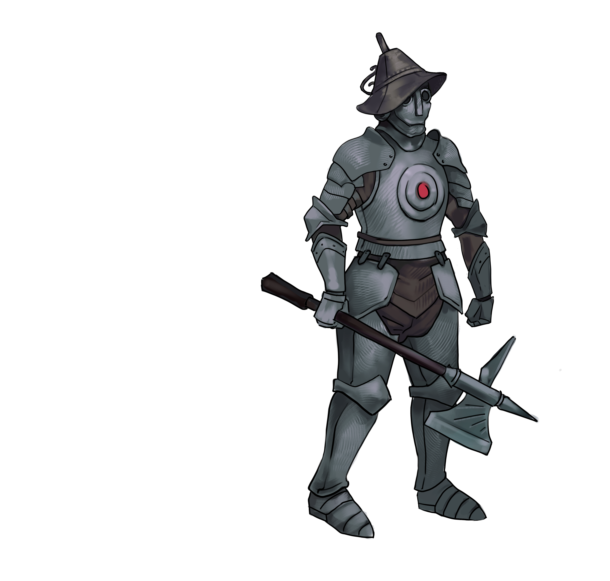
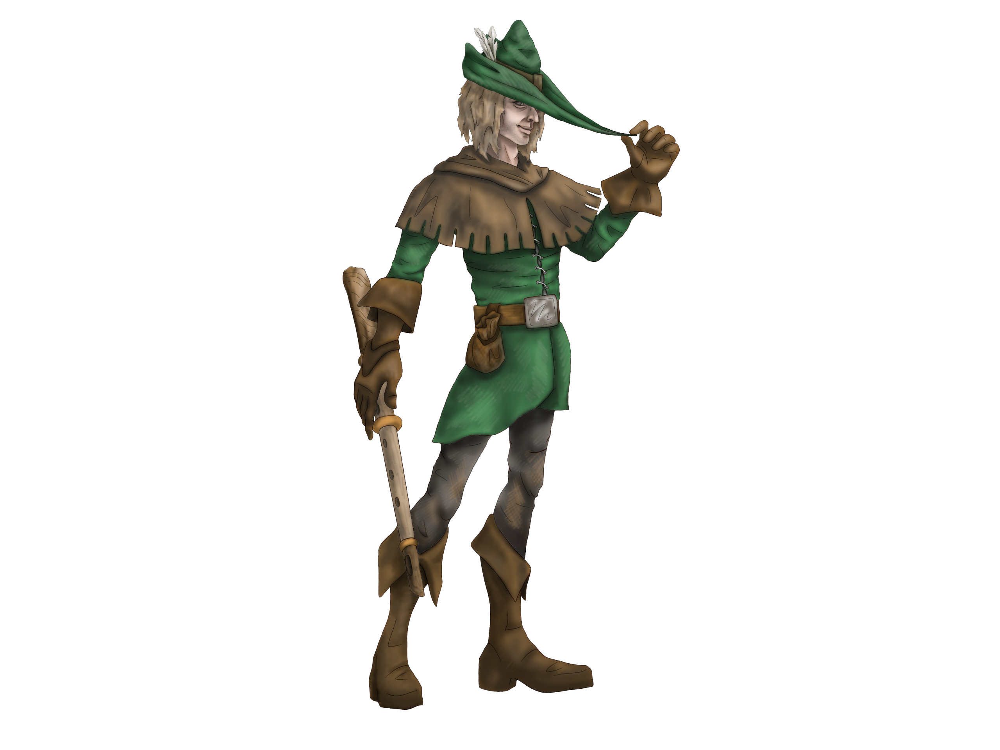

## Описание игры
- **Жанр**: Карточный rogue-lite
- **Платформа**: ПК
- **Аудитория**: 12+

### Сюжет & Сеттинг

Под управлением игрока находится группа из персонажей мировой литературы. В их родные истории проникло “искажение” и они отправились в путешествие по книжным мирам с целью найти источник зла. Герои проходят через три различных мира в каждом из которых побеждают промежуточного искаженного персонажа этой истории, после чего встречают главного злодея - олицетворение цензуры, пропаганды и сожжения книг.

### Игровые персонажи

Перед каждым забегом игрок волен выбрать персонажей из пула и сформировать команду из 3-х героев. Текущие герои:

- **Красная шапочка** - девушка подросток - 14-18 лет.  
  *Агрессивный персонаж нападения.* 
- **Железный дровосек** - дровосек. Железный...  
  *Роль - танк.* 
- **Крысолов** - человек лет сорока, стройного телосложения, ведущий аскетичный образ жизни.  
  *Роль - дебаффер + контроль колоды.* 

### Геймплей в общих чертах

Игра разделена на 2 этапа: Бои и Приключение. Каждый игровой акт разделен на 3-4 главы, определяемых набором карт в приключении. После прохождения всех трех актов происходит битва с финальным боссом.

### Игровой мир

Миры-акты и их мини-боссы:

- **Лес Гримм** — Волк
- **Страна Оз** — Босс Страшила
- **Хутор** — Вий

### Карты сцены приключений и магазин

Сцена приключений представляет собой интерфейс между столкновениями. В начале каждого раунда у игрока есть 3 карты боя, 2 карты случайных встреч, один привал и одна карта ритуала + черная карта начинающая бой с боссом локации.

### Карты персонажей

Колода каждого из персонажей содержит 10 видов карт. 
- 4 базовых 
  - мана
  - добор
  - урон
  - способность
- 4 редких
  - более сложные эффекты способностей
  - особый добор/защита
- 2 золотых 
  - одна уникальная глобальная карта направленная на декбилдинг
  - один уникальный эффект связанный со способностями

### Описание игрового опыта

При запуске игрок попадает на сцену приключений с подсказками на экране. Он волен сыграть лагерь, 2 карты боя и случайное событие. После розыгрыша всех карт происходит стычка с мини-боссом.

### Описание карточной механики

В начале каждого хода враг обозначает свои действия в этом ходу и обозначает цели для атак. Игрок набирает 6 карт из колоды. Большинство карт требуют для розыгрыша чернила. Чернила получаются с бесплатных карт + каждый ход выдается 1 единица чернил.
